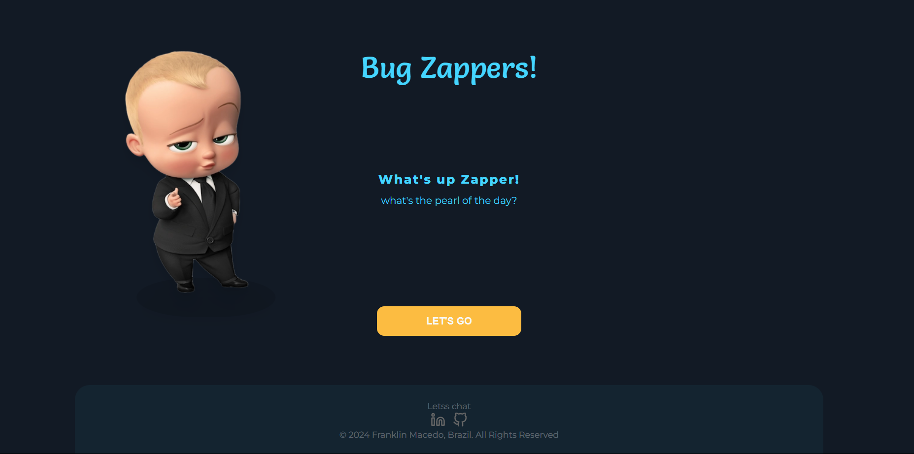

# Bug Zappers!

Welcome to Bug Zappers! This project aims to zap away your coding bugs with some inspiration from Kanye West and a touch of style.

## Overview

Bug Zappers is a Next.js application that fetches Kanye West quotes using the [Kanye.rest API](https://kanye.rest/) and displays them with a Boss Baby twist.

## Features

- Fetches Kanye West quotes from the API.
- Displays the fetched quote with a stylish layout.
- Allows users to generate new quotes with a button click.
<!-- - Ability to share quotes on LinkedIn. (Feature temporarily commented out) -->

## Technologies Used

- **Next.js**: The framework for React applications.
- **React**: JavaScript library for building user interfaces.
- **Tailwind CSS**: A utility-first CSS framework for styling.
- **TypeScript**: A typed superset of JavaScript that compiles to plain JavaScript.

## Getting Started

1. Clone this repository to your local machine.
2. Navigate to the project directory.
3. Install dependencies using `npm install`.
4. Run the development server using `npm run dev`.
5. Open [http://localhost:3000](http://localhost:3000) to view the app in your browser.

## How to Use

1. Click on the "LET'S GO" button to fetch a new Kanye West quote.
2. Enjoy the wisdom or humor of the displayed quote.
3. Repeat step 1 to get more quotes.

<!-- 4. (Feature temporarily commented out) Click on the "Compartilhar" button to share the quote on LinkedIn. -->

<!-- 
## Contributing

Contributions are welcome! Feel free to fork this repository, make changes, and submit a pull request.

## License

This project is licensed under the MIT License. See the [LICENSE](LICENSE) file for details. -->

