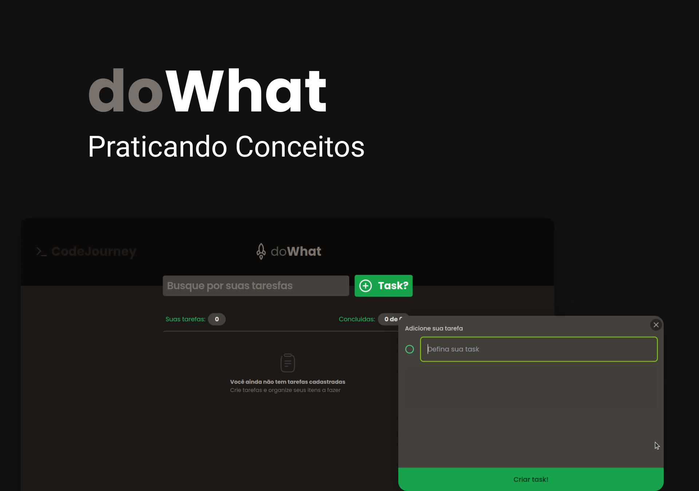

# What To Do - Aplicativo de Lista de Tarefas

O What To Do é uma aplicação web para gerenciamento de lista de tarefas, onde os usuários podem adicionar, editar, excluir e marcar tarefas como concluídas.


<details>
<summary><strong>Click para exibir em portugues 🇧🇷 </strong></summary>

## Instalação

1. Clone o repositório para o seu ambiente local:

```bash
git clone https://github.com/Frankdias92/code-challenges.git
```

2. Instale as dependências do projeto:

```bash
npm install
```

3. Inicie o servidor de desenvolvimento:

```bash
npm start
```

## Uso

Após iniciar o servidor, acesse a aplicação em [http://localhost:5173](http://localhost:5173) no seu navegador.

### Recursos Principais:

- **Adicionar Tarefa:** Os usuários podem adicionar novas tarefas utilizando o botão "+".
- **Editar Tarefa:** Clicando em uma tarefa existente, os usuários podem editar o título e o conteúdo da tarefa.
- **Excluir Tarefa:** Os usuários podem excluir uma tarefa clicando no ícone de lixeira.
- **Marcar Tarefa Concluída:** Os usuários podem marcar uma tarefa como concluída clicando no ícone de marcação.

## Estrutura do Projeto

O projeto está estruturado da seguinte maneira:

```
what-to-do/
  ├── src/
  │   ├── components/
  │   │   ├── header.tsx
  │   │   ├── newNoteTask.tsx
  │   │   ├── noteTask.tsx
  │   │   └── ...
  │   ├── app.tsx
  │   └── ...
  ├── public/
  ├── package.json
  └── README.md
```

## Tecnologias Utilizadas

- React
- TypeScript
- Radix UI
- Lucide React
- Sonner (para notificações)

## Contribuição

Contribuições são bem-vindas! Sinta-se à vontade para abrir uma issue ou enviar uma solicitação de pull.

## Licença

Este projeto é licenciado sob a [Licença MIT](https://opensource.org/licenses/MIT).

## Autor

Nome do Autor - [@Frankdias92](https://github.com/Frankdias92)

## Créditos

#### À Escola Rocketseat e Equipe:

Gostaria de expressar à Escola Rocketseat e à sua incrível equipe por fornecerem recursos valiosos, suporte inestimável e inspiração constante ao longo do desenvolvimento deste projeto. Sem o apoio e a orientação excepcionais da Rocketseat e do Diego, este projeto não teria se tornado realidade.

Agradeço por:

Conteúdo de alta qualidade: Aprofundei meus conhecimentos e aprimorei minhas habilidades através dos cursos, tutoriais e materiais didáticos impecáveis da Rocketseat.
Comunidade vibrante: Encontrei suporte, colaboração e troca de experiências valiosas na comunidade engajada da Rocketseat, composta por alunos e profissionais talentosos.
Suporte personalizado: A equipe da Rocketseat se mostrou sempre disponível e pronta para solucionar dúvidas, oferecer orientação e solucionar problemas com presteza e profissionalismo.

À Autora do Design Original, Millena Martins:

Meus sinceros agradecimentos à talentosa Millena Martins pela criação do design original que serviu como base para este projeto. Sua criatividade, bom gosto e atenção aos detalhes resultaram em um design inspirador e de alta qualidade, que guiou e elevou meu trabalho.


Conclusão:

O sucesso deste projeto se deve, em grande parte, ao apoio fundamental da Escola Rocketseat, sua equipe dedicada, Diego, Mayk e à talentosa Millena Martins. Sou imensamente grato por suas contribuições inestimáveis e por tornarem este projeto uma realidade.

## Aprendezido com esse projeto

Durante o desenvolvimento do projeto "doWhat", foram adquiridos diversos conhecimentos e habilidades em diferentes áreas. Abaixo, destacam-se os principais aprendizados obtidos:

Desenvolvimento Frontend com React:

Aprofundei-me no uso do React para criar interfaces de usuário dinâmicas e interativas com tailwind.

Aprendi a criar e gerenciar componentes reutilizáveis, melhorando a organização e manutenção do código.

Integração de Bibliotecas Externas: 

Ganhei experiência na integração de bibliotecas de terceiros, como @radix-ui/react-dialog e lucide-react, para adicionar funcionalidades pré-construídas ao projeto.

Persistência de Dados com localStorage:

Implementei a persistência de dados utilizando o localStorage do navegador, permitindo que as tarefas fossem salvas localmente e recuperadas entre sessões.

Gerenciamento de Estado com Hooks:

Utilizei os hooks useState e useEffect para gerenciar o estado dos componentes, proporcionando uma experiência de usuário mais dinâmica e responsiva.

Acessibilidade e Usabilidade:

Explorei práticas de acessibilidade ao garantir que o projeto fosse acessível a uma ampla gama de usuários, incluindo a adição de descrições alternativas para ícones e o uso de elementos semânticos adequados.

</details>


---

<details>
<summary><strong>Click to display in English 🇺🇸
 </strong></summary>


## What To Do: A To-Do List App

What To Do is a web application for managing task lists, where users can add, edit, delete, and mark tasks as completed.

## Installation

1. Clone the repository to your local environment:

```bash
git clone https://github.com/Frankdias92/code-challenges.git
```

2. Install the project's dependencies:

```bash
npm install
```

3. Start the development server:

```bash
npm start
```

## Usage

After starting the server, access the application at http://localhost:5173 in your browser.

### Main Features:

- **Add Task:** Users can add new tasks using the "+" button.
- **Edit Task:** By clicking on an existing task, users can edit the task's title and content.
- **Delete Task:** Users can delete a task by clicking on the trash icon.
- **Mark Task as Completed:** Users can mark a task as completed by clicking on the checkmark icon.

## Project Structure

The project is structured as follows:

```
what-to-do/
  ├── src/
  │   ├── components/
  │   │   ├── header.tsx
  │   │   ├── newNoteTask.tsx
  │   │   ├── noteTask.tsx
  │   │   └── ...
  │   ├── app.tsx
  │   └── ...
  ├── public/
  ├── package.json
  └── README.md
```

## Technologies Used

- React
- TypeScript
- Radix UI
- Lucide React
- Sonner (for notifications)

## Contributing

Contributions are welcome! Feel free to open an issue or submit a pull request.

## License

This project is licensed under the MIT License: [https://opensource.org/licenses/MIT](https://opensource.org/licenses/MIT).

## Author

Author Name - @Frankdias92: [https://github.com/Frankdias92](https://github.com/Frankdias92)

## Credits

#### To Rocketseat School and Team:

I would like to express my sincere gratitude to Rocketseat School and its incredible team for providing valuable resources, invaluable support, and constant inspiration throughout the development of this project. Without the exceptional support and guidance of Rocketseat and Diego, this project would not have become a reality.

I am grateful for:

* High-quality content: I deepened my knowledge and improved my skills through Rocketseat's impeccable courses, tutorials, and teaching materials.
* Vibrant community: I found support, collaboration, and valuable exchange of experiences in Rocketseat's engaged community, composed of talented students and professionals.
* Personalized support: The Rocketseat team was always available and ready to solve doubts, offer guidance, and solve problems with promptness and professionalism.

To the Original Design Author, Millena Martins:

My sincere thanks to the talented Millena Martins for creating the original design that served as the basis for this project. Her creativity, good taste, and attention to detail resulted in an inspiring and high-quality design that guided and elevated my work.


Conclusion:

The success of this project is largely due to the fundamental support of Rocketseat School, its dedicated team, Diego, Mayk, and the talented Millena Martins. I am immensely grateful for their invaluable contributions and for making this project a reality.

## Learnings from this project

During the development of the "doWhat" project, several knowledge and skills were acquired in different areas. Below, the main learnings obtained are highlighted:

Frontend Development with React:

* I deepened my use of React to create dynamic and interactive user interfaces with Tailwind.
* I learned how to create and manage reusable components, improving code organization and maintainability.

Integration of External Libraries:

* I gained experience integrating third-party libraries, such as @radix-ui/react-dialog and lucide-react, to add pre-built features to the project.

Data Persistence with localStorage:

* I implemented data persistence using the browser's localStorage, allowing tasks to be saved locally and retrieved between sessions.

State Management with Hooks:

* I used the useState and useEffect hooks to manage the state of the components, providing a more dynamic and responsive user experience.

Accessibility and Usability:

* I explored accessibility practices by ensuring that the project was accessible to a wide range of users, including adding alt text for icons and using appropriate semantic elements.


</details>


## Preview

[Live](https://do-what-dxulaskua-frankdias92s-projects.vercel.app/)


